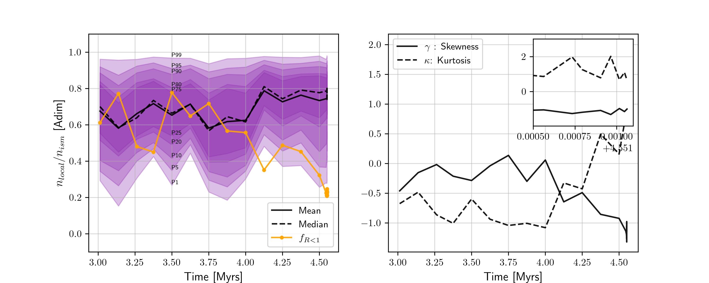
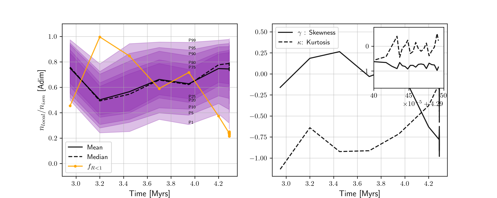
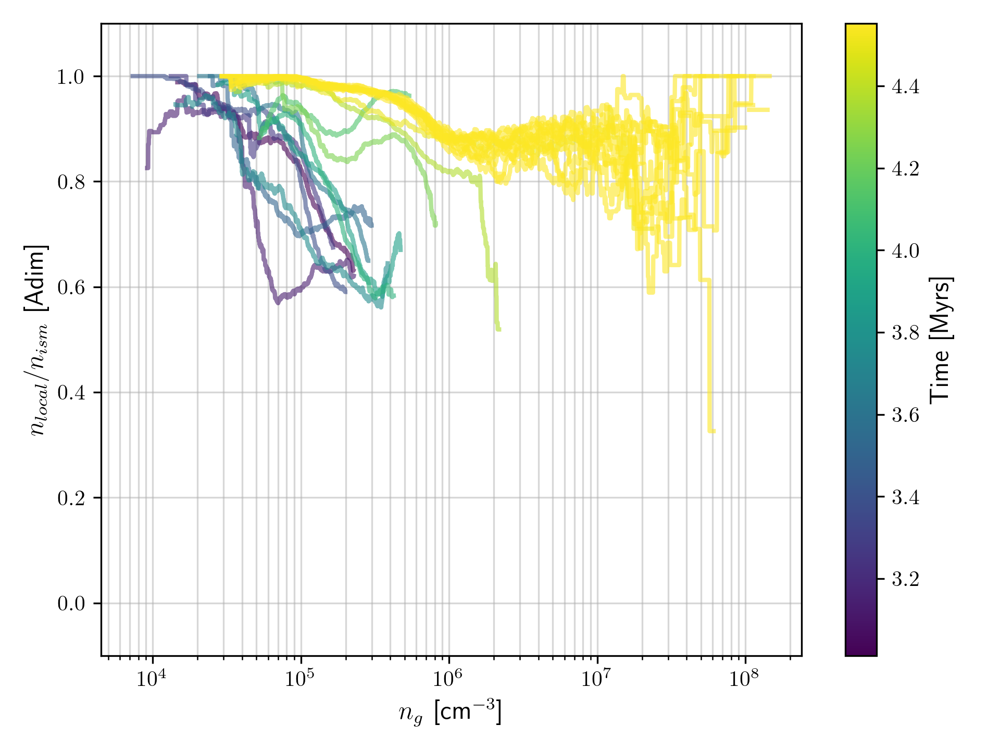
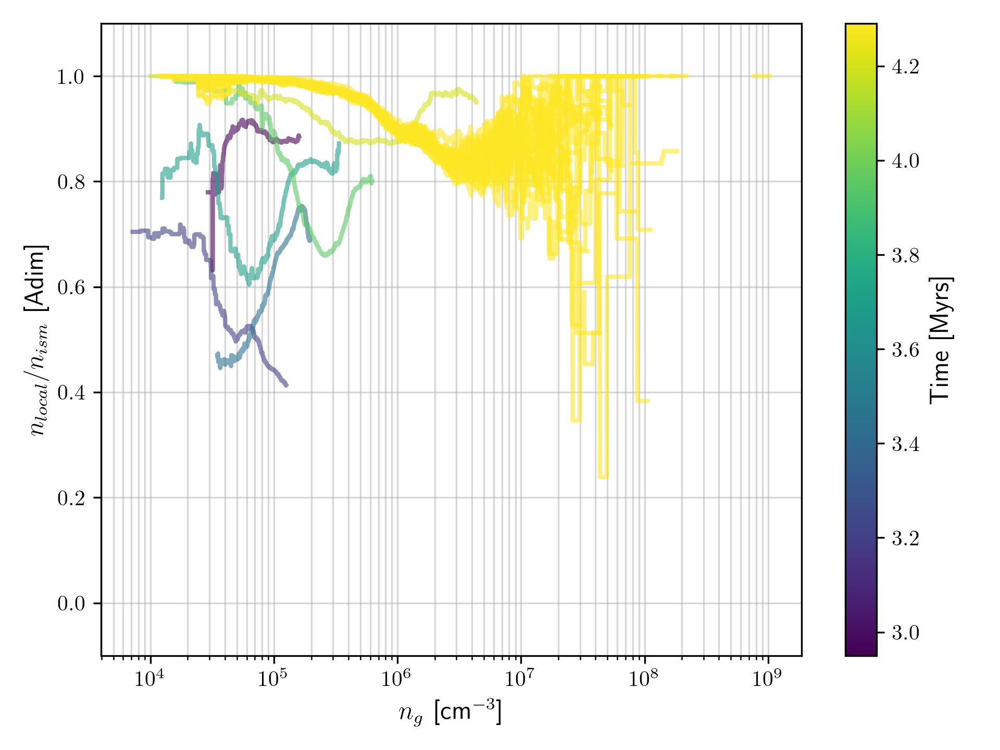

---
Output Files descriptions
---

# data_[ideal-amb].pkl

This output file contains

        stats_dict = {
            "time": _time,
            "x_input": x_input,
            "n_rs": n_rs,
            "B_rs": B_rs,
            "n_path": path_column,
            "n_los0": mean_column,
            "n_los1": median_column,
            "surv_fraction": survivors_fraction[each],
            "r_u": r_u,
            "r_l": r_l
        }
for every snapshots posterior to the initial 3 million years \[Myrs\].

# data1_[ideal-amb].pkl

This output file contains

        field_dict = {
            "time": _time,
            #"x_index": follow_index,
            "directions": directions,
            "x_input": x_input,
            "B_s": magnetic_fields,
            "r_s": radius_vectors,
            "n_s": numb_densities
        }

corresponds with the complete field lines passing through each starting points. This files can be somewhat heavy ~1-2 GB, so they are replaced in each run.

# data_dc_[1.0-2.0]_[ideal-amb].pkl

This output file contains

        stats_dict = {
            "time": _time,
            "x_input": x_input,
            "n_rs": n_rs,
            "B_rs": B_rs,
            "n_path": path_column,
            "n_los0": mean_column,
            "n_los1": median_column,
            "surv_fraction": survivors_fraction[each],
            "r_u": r_u,
            "r_l": r_l
        }
where, \[1.0-2.0\] is the log base 10 of the threshold to generate points in cloud.

# Images

## Evolution of local_cr_density fraction PDF

## Evolution of local_cr_density fraction PDF vs density

